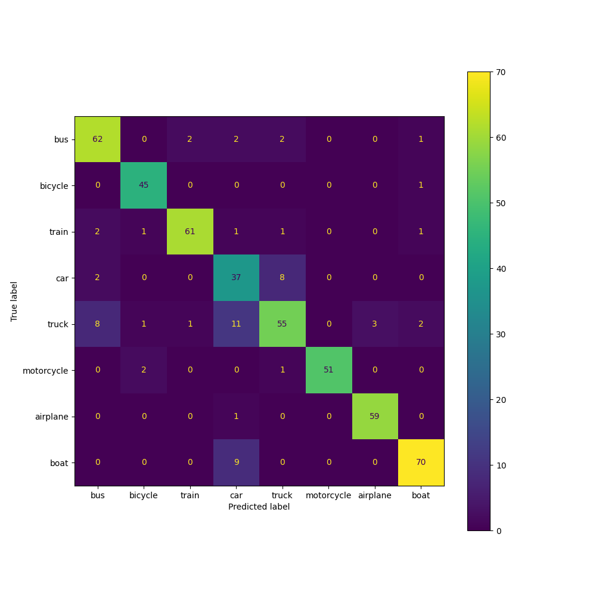
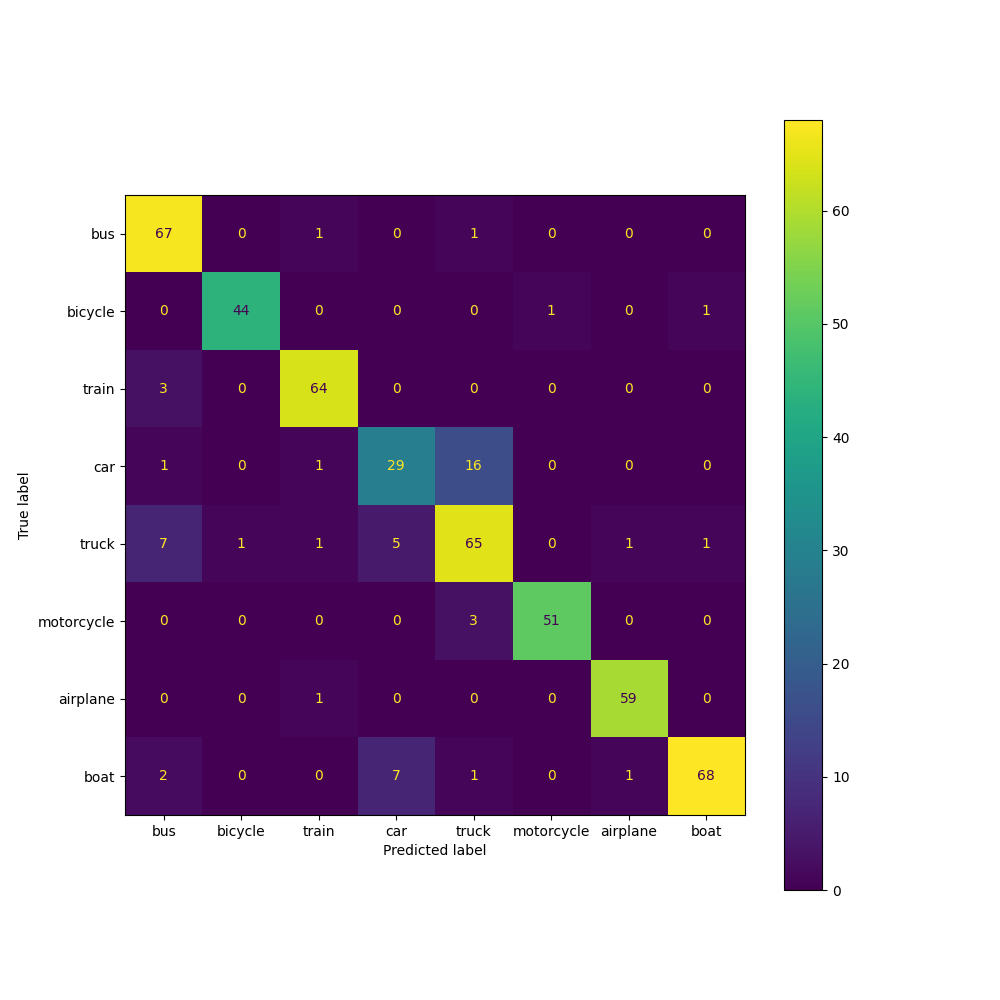

# Few Shot Classification Experiments

## Datset
Experiments are performed on the uploaded [Data](./data/coco_crops_few_shot) having 8 classes.

## Approaches

### First approach:
Exploring [openAI CLIP](https://github.com/openai/CLIP)
run `python test_clip_fewshot.py`. For the classification report [check here](Results_base/clip_fewshot_test.txt)

### Second approach:
Nearest class Mean based classification with encoded image feature using [openAI CLIP](https://github.com/openai/CLIP)
run `python run_NCM_fewshot.py`. For the classification report [check here](Results_NCM/NCM_fewshot.txt)

### Third approach
Extending [openAI CLIP](https://github.com/openai/CLIP) with one layered fully connected network for classification.
run `python run_net_fewshot.py`. For the classification report [check here](Results_net/net_fewshot.txt)

# Zero Shot Classification

## Datset
Experiments are performed on the uploaded [Data](./data/coco_crops_zero_shot).
If the highest classification score usong a pretrained model < 0.5, consider it as unseen class

Further, run CLIP on those images with possible labels from public dataset (COCO in this case) and check.
The new class and detected image can be seggrated this way. After little human verification these data can be added to the training datset.